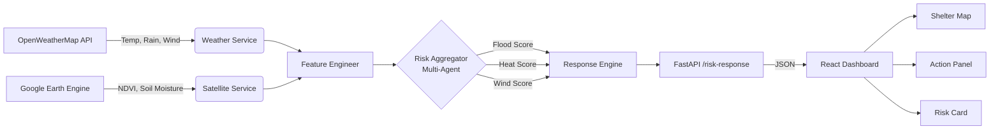

# 🛡️ Sentinel — AI Disaster Early Warning System

A **production-grade, multi-agent disaster intelligence platform** that ingests real-time environmental telemetry, runs autonomous risk prediction, and delivers actionable shelter routing through a cinematic, motion-rich web interface.

> Built for the Hackathon. Designed for the real world.

---

## 🚀 Live Architecture



---

## 🧠 Tech Stack

| Layer | Technology |
|---|---|
| **Backend Intelligence** | Python 3.10, FastAPI, Uvicorn |
| **Risk Models** | Custom Multi-Agent Aggregator (Flood, Heat, Wind) |
| **Data Sources** | OpenWeatherMap One Call API, Google Earth Engine |
| **Database** | MongoDB (Shelter Registry) |
| **Frontend** | React 18, Vite, Tailwind CSS, Framer Motion |
| **Geospatial** | Leaflet, React-Leaflet |
| **Icons** | Lucide React |

---

## ⚙️ Local Setup

### 1. Backend

```bash
# Clone & enter project
cd DisasterEarlyWarning

# Create virtual environment
python -m venv .venv
.venv\Scripts\activate  # Windows

# Install dependencies
pip install -r requirements.txt

# Configure environment
cp .env.example .env
# Fill in your API keys in .env

# Run the API server
uvicorn src.api.main:app --reload --port 8000
```

### 2. Frontend

```bash
cd frontend
npm install
npm run dev
# Opens at http://localhost:5173
```

---

## 🔑 Environment Variables

Create a `.env` file in the project root:

```env
OPENWEATHERMAP_API_KEY=your_key_here
GEE_PROJECT_ID=your_gee_project_id
MONGODB_URI=mongodb://localhost:27017
DATABASE_NAME=sentinel_db
DEFAULT_LAT=24.8607
DEFAULT_LON=67.0011
```

---

## 📡 API Reference

### `GET /risk-response`

Returns unified risk intelligence for a given coordinate.

**Parameters:**
| Param | Type | Default | Description |
|---|---|---|---|
| `lat` | float | 24.8607 | Latitude |
| `lon` | float | 67.0011 | Longitude |

**Example:**
```bash
curl "http://localhost:8000/risk-response?lat=24.8607&lon=67.0011"
```

**Response:**
```json
{
  "status": "success",
  "risk": {
    "score": 42,
    "adjusted_score": 48,
    "level": "Medium",
    "confidence": 0.85
  },
  "priority": "ADVISORY ACTIVE",
  "primary_threat": "Flood Risk",
  "actions": ["Monitor river levels", "Prepare emergency kit"],
  "shelters": [
    { "name": "City Relief Center", "lat": 24.87, "lon": 67.01, "distance_km": 1.2 }
  ]
}
```

---

## ☁️ Deployment

### Backend → Railway

1. Push repo to GitHub
2. Create new project on [Railway](https://railway.app)
3. Connect GitHub repo
4. Set environment variables in Railway dashboard
5. Railway auto-detects Python and deploys

**Start command:**
```bash
uvicorn src.api.main:app --host 0.0.0.0 --port $PORT
```

### Frontend → Vercel

1. Import GitHub repo on [Vercel](https://vercel.com)
2. Set **Framework Preset**: Vite
3. Set **Root Directory**: `frontend`
4. Add environment variable:
   ```
   VITE_API_URL=https://your-backend.up.railway.app
   ```
5. Deploy — Vercel handles the rest

---

## 🗺️ Pages

| Route | Description |
|---|---|
| `/` | Cinematic landing page with animated hero |
| `/dashboard` | Live tactical dashboard with real-time risk, map, and actions |
| `/demo` | Interactive simulation workspace with sliders |
| `/about` | Technical architecture brief and stack overview |

---

## 🔍 Key Features

- **Multi-Agent Risk Engine** — Flood, heat, and wind models collaborate to generate a composite risk score
- **Autonomous Fallback Telemetry** — System remains operational even if weather API fails
- **GPS-Aware Dashboard** — Detects user location, auto-refreshes every 5 minutes
- **Dynamic Alert States** — Green/yellow/red visual system with pulsing animations and emergency lockdown mode
- **Confidence-Aware UI** — Shows "Data Integrity Gap" banner when AI confidence < 60%
- **Map Auto-Focus** — On High risk, map flies to nearest shelter automatically

---

*Sentinel — Scaling the next generation of humanitarian resilience through autonomous intelligence.*
